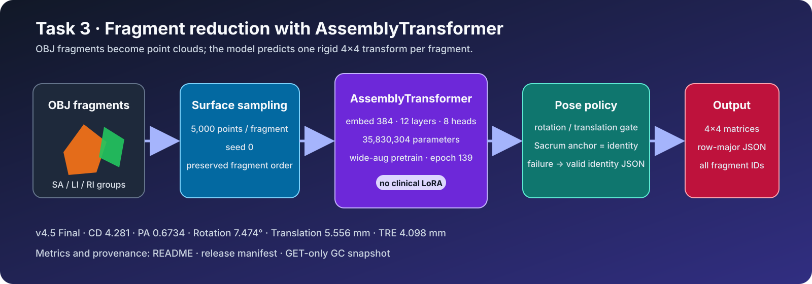

# PENGWIN 2026 — Task 3 골절 조각 정복 계획

[](LICENSE)
[](#1-과제와-최종-보존-상태)
[](#3-전체-파이프라인)
[](#8-전체-submission-snapshot)

OBJ로 제공되는 골반 골절 조각을 정상 해부학적 위치로 이동시키는 조각별 4×4 강체변환을 예측한다.
최종 v4.5는 AssemblyTransformer를 wide-augmentation simulation data로 학습한 epoch 139
checkpoint를 사용하며 clinical LoRA를 사용하지 않는다. 이 저장소는 원본 release
`v4.5@e8af95c`를 기준으로 정리한 대회 종료 보존본이다.



## 목차

1. [과제와 최종 보존 상태](#1-과제와-최종-보존-상태)
2. [최종 GC 결과](#2-최종-gc-결과)
3. [전체 파이프라인](#3-전체-파이프라인)
4. [모델과 학습](#4-모델과-학습)
5. [Pose policy와 실패 처리](#5-pose-policy와-실패-처리)
6. [입출력·저장소 구조](#6-입출력저장소-구조)
7. [빌드와 검증](#7-빌드와-검증)
8. [전체 submission snapshot](#8-전체-submission-snapshot)
9. [재현성 경계](#9-재현성-경계)

## 1. 과제와 최종 보존 상태

| 항목 | 최종 보존값 |
|---|---|
| 과제 | 3D fracture reduction / rigid assembly |
| 입력 | SA/LI/RI fragment group을 포함한 OBJ |
| 출력 | 조각별 row-major 4×4 transform JSON |
| source 기준 | immutable tag `v4.5`, commit `e8af95c` |
| 모델 | AssemblyTransformer |
| 모델 크기 | 35,830,304 parameters |
| 학습 | wide-augmentation simulation pretraining, epoch 139 |
| clinical LoRA | 사용하지 않음 |
| model archive | `model.tar.gz`, 399,697,661 bytes |
| outer SHA-256 | `e392f5d7b412835c7b8a87c4e59cc50ef882b68f173583be3598ad83c0d112a3` |
| inner checkpoint SHA-256 | `2ebd94e1d17322d8636eb6caf89e84ffcdd27f1633ffc562e27fdb54887d4faf` |
| GC 대표 행 | `ruruguru v4.5`, Final 10/19, MP 10.0 |

`10/19`는 account/submission 행 순위이며 공식 중복 제거 team rank가 아니다.

## 2. 최종 GC 결과

GET-only snapshot `20260818T140325Z`에서 확인한 `ruruguru v4.5` Final 결과다.

| 지표 | 값 | 방향 | 의미 |
|---|---:|:---:|---|
| Chamfer Distance | 4.2810 | ↓ | 조립된 surface 간 거리 |
| Part Accuracy | 0.6734 | ↑ | 허용 CD 안에 든 fragment 비율 |
| Rotation Error | 7.4739° | ↓ | 조각별 geodesic rotation error |
| Translation Error | 5.5556 mm | ↓ | 조각 무게중심 이동 오차 |
| TRE | 4.0979 mm | ↓ | 대응점 target registration error |
| Mean Position | 10.0 | ↓ | 다섯 지표 순위의 평균 |

평가 ID는 `93717dda-a3b2-4b36-b1ff-7ce943ad1c23`, submission ID는
`b7bf0bd8-c6e1-43e8-8018-5766261bae4a`다. GC model object와 로컬 tar의 byte-level binding은
API에서 제공되지 않았다.

## 3. 전체 파이프라인

```text
OBJ fragments
  │
  ├─ g/o group에서 fragment ID 파싱
  │    └─ Sacrum / Left Ilium / Right Ilium
  │
  ├─ fragment별 surface point 5,000개 sampling
  │    └─ fixed seed 0
  │
  ├─ AssemblyTransformer
  │    └─ fragment embedding → rotation + translation
  │
  ├─ pose policy
  │    ├─ catastrophe / anti-overshoot gate
  │    └─ invalid output은 identity로 형식 복구
  │
  ├─ 가장 작은 Sacrum fragment를 identity anchor로 정규화
  │
  └─ 모든 fragment의 4×4 matrix를 JSON으로 기록
```

Task 3는 segmentation이 아니라 rigid assembly 문제다. 입력 mesh를 voxel mask로 변환하지 않고
surface point cloud에서 조각 간 전역 구성을 추정한다.

## 4. 모델과 학습

| 구성 | 값 |
|---|---:|
| embedding dimension | 384 |
| transformer layers | 12 |
| attention heads | 8 |
| surface samples | 5,000 / fragment |
| parameters | 35,830,304 |
| selected epoch | 139 |

최종 checkpoint는 넓은 회전·이동 augmentation을 적용한 simulation pretraining 결과다. 임상 170
case는 policy 개발에 사용됐고 Task 1 cohort와 겹치므로 독립 test set으로 부르지 않는다. 과거
clinical LoRA와 AO-ramp 후보는 최종 v4.5에 포함하지 않았다.

## 5. Pose policy와 실패 처리

- 중심 이동이 30 mm를 초과하거나 회전이 25°를 초과하면 identity를 사용한다.
- 중심 이동이 12 mm 미만이면서 회전이 6° 미만인 작은 보정도 identity로 되돌린다.
- 가장 작은 Sacrum fragment를 anchor로 선택하고 최종 출력에서 identity로 고정한다.
- fragment가 없거나 model subprocess가 실패해도 입력에 존재한 모든 ID의 4×4 identity를 기록한다.
- identity fallback은 JSON interface 복구 계약일 뿐 성능 하한을 보장한다는 뜻이 아니다.

## 6. 입출력·저장소 구조

```text
.
├── inference/
│   ├── inference.py       GC wrapper, subprocess와 JSON fallback
│   └── reduction.py       OBJ parsing과 pose normalization
├── baseline/
│   ├── inference.py       AssemblyTransformer full-model inference
│   ├── models/            model implementation
│   ├── datasets/          point-cloud data module
│   └── configs/           v4.5 inference configuration
├── assets/                pipeline diagram
├── Dockerfile
├── requirements.txt
└── scripts/build_image.sh
```

입력은 `/input` 아래 OBJ, 출력은 `/output/reduction-poses-matrices.json`이다. 각 matrix는 finite한
4×4 row-major 배열이어야 하며 fragment ID는 입력 group과 일치해야 한다.

## 7. 빌드와 검증

```bash
bash scripts/build_image.sh
```

로컬 project root의 CPU wrapper 계약 테스트:

```bash
PYTHONDONTWRITEBYTECODE=1 /opt/miniconda3/envs/pengwin_v2/bin/python \
  -m unittest discover -s code_task3/tests -v
```

최종 정리에서 OBJ group 순서와 중복 제거, 모든 fragment의 identity fallback, group이 없는 OBJ의
anchor 출력을 검증했다. 모델 archive의 outer/inner SHA-256, complete tar readback, safe path도
확인했다. 컨테이너 rebuild, full checkpoint inference와 170-case evaluator 재실행은 수행하지 않았다.

## 8. 전체 submission snapshot

코드, final model tar, 포털 문구, 평가 기록과 release manifest를 포함한 전체 보존본은 GitHub
Release `competition-final-20260819`에 있다.

- [전체 Task 3 submission archive](https://github.com/RURUGURU/pengwin2026-task3-reduction/releases/download/competition-final-20260819/submission_task3_competition_final_20260819.tar.gz)
- [SHA-256 checksum](https://github.com/RURUGURU/pengwin2026-task3-reduction/releases/download/competition-final-20260819/submission_task3_competition_final_20260819.tar.gz.sha256)

archive는 `submission_task3/github_repo/.git`만 제외하며 source tree, v4.5 model tar, portal, reports와
`RELEASE_MANIFEST.json`을 포함한다.

## 9. 재현성 경계

- GC active image 여부와 model object–tar byte binding은 API에서 확인할 수 없다.
- identity fallback은 출력 형식 복구이며 임상적 성능 보장이 아니다.
- clinical 170-case policy 결과는 같은 cohort에서 선택·평가된 개발 결과다.
- displayed rank는 account/submission 행 기준이며 공식 deduplicated team rank가 아니다.
- vector diagram은 실행 계약 설명용이며 실제 환자 mesh를 나타내지 않는다.

세부 ID, hash와 미실행 검증은 전체 snapshot의 `RELEASE_MANIFEST.json`에서 확인할 수 있다.
